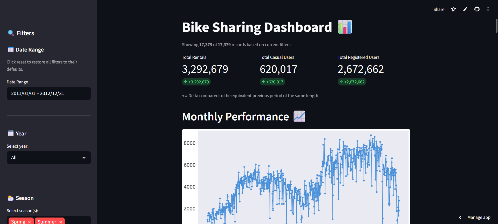

<div align="center">

# 🚲 Bike Sharing Dashboard

**An interactive data analysis dashboard exploring bike rental behavior patterns**

[](https://bike-sharing-dshaq7y7plk7tlbvz2bs2b.streamlit.app/)


</div>

---

## 📸 Preview

> 🔗 **Live Demo:** [bike-sharing-dshaq7y7plk7tlbvz2bs2b.streamlit.app](https://bike-sharing-dshaq7y7plk7tlbvz2bs2b.streamlit.app/)

<!-- Add your dashboard screenshot here -->


---

## 📋 Table of Contents

- [Overview](#-overview)
- [Business Questions](#-business-questions)
- [Key Insights](#-key-insights)
- [Dashboard Features](#-dashboard-features)
- [Project Structure](#-project-structure)
- [Setup & Run Locally](#-setup--run-locally)
- [Dataset](#-dataset)
- [Author](#-author)

---

## 🔎 Overview

This project is a comprehensive data analysis of the **Capital Bikeshare system in Washington D.C.**, covering hourly rental records from **2011–2012** (17,379 rows). It was developed as the final project for the **Fundamental Data Analysis** course in the Coding Camp Independent Study Program.

The analysis goes beyond basic EDA by applying:
- **Manual time-of-day clustering** — segmenting hours into Late Night, Morning Rush Hour, Midday, Evening Rush Hour, and Night
- **Temporal RFM Segmentation** — adapting the RFM framework to daily rental data without machine learning
- **Peak Hour Analysis** — identifying commuter vs. leisure usage patterns through heatmaps and line charts

---

## ❓ Business Questions

| # | Question |
|---|----------|
| 1 | How has the number of bike rentals trended over time? |
| 2 | How do casual and registered users compare in total rentals? |
| 3 | How does rental behavior differ between weekdays and weekends? |
| 4 | How does rental behavior differ across seasons? |
| 5 | What are the peak rental hours, and how do they differ between weekdays and weekends? |
| 6 | How can days be segmented by rental volume to identify high-value and low-activity periods? |

---

## 💡 Key Insights

> **📈 Growth**
> Rentals grew approximately **6× from 2011 to 2012**, with a consistent seasonal peak each year in mid-to-late year (August–October).

> **👥 User Type**
> **Registered users (81%)** far outnumber casual users (19%). Registered users drive weekday demand while casual users are more active on weekends — indicating distinct commuter vs. leisure profiles.

> **🕐 Peak Hours**
> Weekday rentals spike sharply at **08:00 and 17:00–18:00** (classic bimodal commuter pattern). Weekend rentals form a single broad peak around **11:00–15:00**, reflecting recreational usage.

> **📊 RFM Segmentation**
> Champion days cluster in **August–October**. January–February are dominated by Low Activity days — prime targets for off-season promotions.

---

## ✨ Dashboard Features

<table>
  <tr>
    <th>Feature</th>
    <th>Description</th>
  </tr>
  <tr>
    <td>🔍 <b>Interactive Filters</b></td>
    <td>Date range, Year, Season, Weather condition, Day type — all applied dynamically</td>
  </tr>
  <tr>
    <td>📊 <b>Delta Metrics</b></td>
    <td>KPI cards show change vs. the equivalent previous period</td>
  </tr>
  <tr>
    <td>🎨 <b>Consistent Design</b></td>
    <td>Uniform color palette with highlight for the highest bar; value annotations on all charts</td>
  </tr>
  <tr>
    <td>🕐 <b>Peak Hour Analysis</b></td>
    <td>Grouped bar, heatmap (hour × day of week), and dual-line chart (weekday vs. weekend)</td>
  </tr>
  <tr>
    <td>📊 <b>Temporal RFM</b></td>
    <td>Manual segmentation of days into Champions / Loyal Days / Potential / Low Activity</td>
  </tr>
  <tr>
    <td>🛡️ <b>Robust Error Handling</b></td>
    <td>try-except on date filter, warning on empty multiselect, guard on empty filtered result</td>
  </tr>
</table>

---

## 🗂️ Project Structure

```
bike-sharing/
│
├── 📁 dashboard/
│   ├── dashboard.py               # Main Streamlit dashboard
│   └── bike_sharing_clean.csv     # Cleaned dataset (output of notebook)
│
├── 📄 requirements.txt            # Python dependencies
├── 📄 README.md                   # Project documentation
│
└── 📁 notebook/
    └── Nabilah_Yasmin_Q_Proyek_Analisis_Data.ipynb
```

> ⚠️ **Important:** Run the notebook end-to-end first to generate `bike_sharing_clean.csv` before running the dashboard locally.

---

## ⚙️ Setup & Run Locally

### Prerequisites

- Python **3.10+**
- pip

### 1. Clone the repository

```bash
git clone https://github.com/qasthalani/bike-sharing.git
cd bike-sharing
```

### 2. Create a virtual environment *(recommended)*

```bash
# Windows
python -m venv venv
venv\Scripts\activate

# macOS / Linux
python3 -m venv venv
source venv/bin/activate
```

### 3. Install dependencies

```bash
pip install -r requirements.txt
```

### 4. Run the dashboard

```bash
streamlit run dashboard/dashboard.py
```

Open **[http://localhost:8501](http://localhost:8501)** in your browser.

---

## 📦 Dependencies

| Package | Version | Purpose |
|---------|---------|---------|
| `pandas` | 3.0.2 | Data manipulation & aggregation |
| `matplotlib` | 3.10.8 | Base plotting |
| `seaborn` | 0.13.2 | Statistical visualizations |
| `streamlit` | 1.56.0 | Interactive web dashboard |

---

## 📁 Dataset

| Attribute | Detail |
|-----------|--------|
| **Source** | [Bike Sharing Dataset — Kaggle](https://www.kaggle.com/datasets/lakshmi25npathi/bike-sharing-dataset) |
| **File used** | `hour.csv` |
| **Rows** | 17,379 (hourly records) |
| **Period** | January 2011 – December 2012 |
| **Key columns** | `dteday`, `hr`, `season`, `weathersit`, `temp`, `casual`, `registered`, `cnt` |

---

## 👤 Author

<table>
  <tr>
    <td><b>Name</b></td>
    <td>Nabilah Yasmin Qasthalani</td>
  </tr>
  <tr>
    <td><b>Dicoding ID</b></td>
    <td>qasthalaani</td>
  </tr>
  <tr>
    <td><b>Email</b></td>
    <td>qasthalaani@gmail.com</td>
  </tr>
  <tr>
    <td><b>GitHub</b></td>
    <td><a href="https://github.com/qasthalani">@qasthalani</a></td>
  </tr>
</table>

---

<div align="center">

*Fundamental Data Analysis — Coding Camp Independent Study Program © 2026*

</div>
